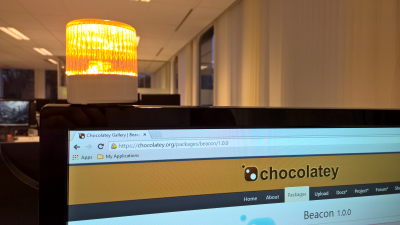

<!-- markdownlint-disable MD041 -->

# Beacon

A TeamCity monitoring tool that uses a Delcom USB LED light to notify your teams

## Backlog

* Support for configuring the RGB values, flash mode and power level of the LED.
* Support for including all TeamCity projects under a certain project node, including more advanced filtering rules.
* Deployment as a Windows Service.

## How to install

The easiest deployment mechanism is to install [Chocolatey](https://chocolatey.org/) and run the following command-line to install the [Chocolate package](https://chocolatey.org/packages/beacon):

    choco install beacon

Then run `beacon` and observe the command-line arguments.

## Example usage

Using a named TeamCity account and running continuously:

    beacon --url=http://yourteamcity.com --username=username --password=password --builds=build_id_1 build_id_2 etc

Or, alternatively using TeamCity guest access, running only once and with verbose logging:

    beacon --url=http://yourteamcity.com --guestaccess --runonce --verbose --builds=build_id_1 build_id_2 etc

## Why another

My original idea was triggered by [TeamFlash](https://github.com/Readify/TeamFlash), a prototype implementation made by Readify. Unfortunately, the quality of that code was way below anything I can work with, so I planned to contribute a big list of improvements as well as more configuration options. However, it took me several emails, tweets and DMs and a month of patience just to get a [single pull request](https://github.com/Readify/TeamFlash/pull/16) accepted. So I see no point in working with a fork. Instead, I decided to take their code as a starting point and revive the product.
